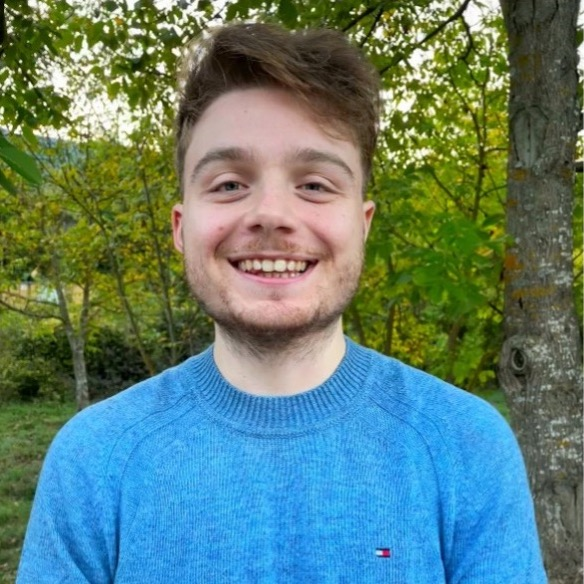

  <!-- Set up a circular image with a border radius of 50% -->
  

  

    <h1>Antony Zappacosta</h1>
    <h3 style="display: inline;">Software engineer</h3>
    <h4 style="display: inline;"> - Munich, Germany</h4>
    <h5>Computer Engineering graduate from the University of Bologna, Italy. Deeply passionate about software engineering and computer vision.</h5>
  

